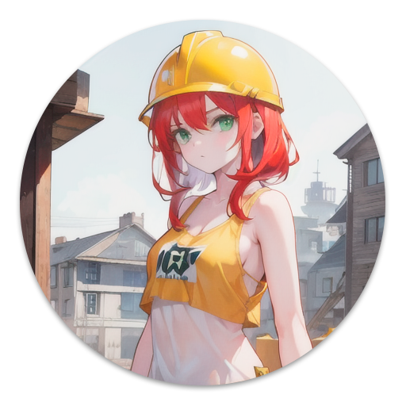

# dizpy
___

Discord API in Python

# Sections
___

[Versions](#versions)

[Getting Started](#getting-started)

[About images](#about-images)

[License](#license)

# Versions
___
Created in

| Python   | Discord |
|----------|---------|
| `3.10.6` | `v10`   |

# Getting Started
___

🚧 Under construction 🚧

# About images
___
All images generate by [Stable Diffusion](https://huggingface.co/CompVis/stable-diffusion)

# License
___
MIT License - read `LICENSE` file